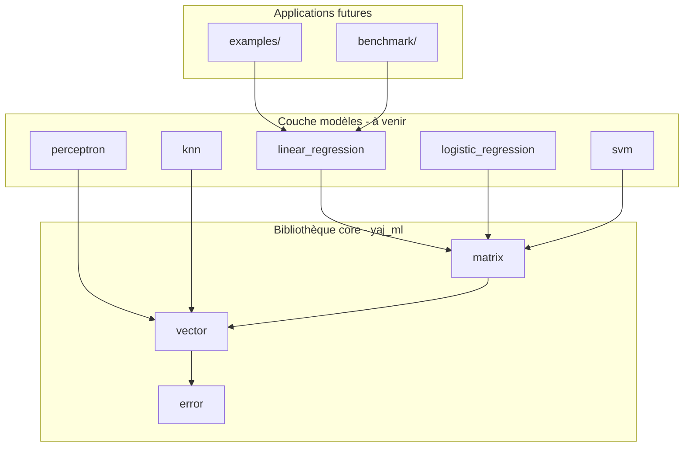

# Architecture du projet

## Vue d'ensemble

YAJ-ML est une bibliothèque de Machine Learning écrite en **C17 pur**, sans dépendances numériques externes (pas de BLAS, LAPACK, Eigen, etc.). Chaque algorithme est implémenté from scratch pour comprendre ce qui se passe « sous le capot ».

```
ML-C/
├── include/yaj_ml/     En-têtes publics (.h)
├── src/                Implémentation de la bibliothèque core
├── models/             Un dossier par algorithme ML
├── tests/              Tests unitaires
├── examples/           Exemples exécutables (futur)
├── benchmark/          Mesures de performance (futur)
├── docs/               Documentation (ce dossier)
├── Makefile            Build simple
└── CMakeLists.txt      Build CMake
```

## Couches du logiciel



### Couche 1 : Core (`src/` + `include/yaj_ml/`)

Fondations réutilisées par tous les modèles :

| Module | Fichiers | Rôle |
|--------|----------|------|
| `error` | `error.h`, `error.c` | Codes d'erreur uniformes |
| `types` | `types.h` | Alias de types (`yaj_ml_index_t`, etc.) |
| `vector` | `vector.h`, `vector.c` | Vecteurs denses, produit scalaire, norme |
| `matrix` | `matrix.h`, `matrix.c` | Matrices row-major, multiplication |

La bibliothèque est compilée en **archive statique** `libyaj_ml.a`. Les futurs modèles s'y lieront.

### Couche 2 : Modèles (`models/`)

Chaque algorithme vit dans son propre dossier :

```
models/
├── linear_regression/
├── logistic_regression/
├── perceptron/
├── knn/
└── svm/
```

Pour l'instant, ces dossiers ne contiennent que des stubs CMake — pas encore de code ML.

### Couche 3 : Tests (`tests/`)

Harness de test maison (zéro dépendance externe) :

- `test_harness.h` — macros `TEST`, `ASSERT_EQ`, `ASSERT_NEAR`
- `test_main.c` — point d'entrée, exécute tous les tests
- `test_vector.c`, `test_matrix.c`, `test_error.c` — tests unitaires

## Convention API des modèles

Tout modèle ML exposera la même « forme » de fonctions :

```c
<model>_init(...);      // alloue et configure
<model>_fit(...);       // entraîne sur des données
<model>_predict(...);   // prédit une sortie
<model>_score(...);     // évalue la performance
<model>_free(...);      // libère toute la mémoire
```

Voir [`include/yaj_ml/model_api.h`](../../include/yaj_ml/model_api.h) pour les règles de propriété mémoire.

## Gestion de la mémoire

Principe fondamental : **chaque allocation a un free correspondant**.

| Action | Fonction | Propriétaire |
|--------|----------|--------------|
| Créer un vecteur | `vec_create` | L'appelant possède le `yaj_ml_vec_t` |
| Détruire un vecteur | `vec_free` | Libère `data` interne |
| Créer une matrice | `mat_create` | L'appelant possède le `yaj_ml_mat_t` |
| Détruire une matrice | `mat_free` | Libère `data` interne |

Ne jamais appeler `free()` directement sur `vec->data` ou `mat->data`.

## Gestion des erreurs

Toutes les fonctions publiques retournent `yaj_ml_status_t` :

```c
typedef enum {
    YAJ_ML_OK = 0,
    YAJ_ML_ERR_NULL_PTR,
    YAJ_ML_ERR_ALLOC,
    YAJ_ML_ERR_DIM,
    YAJ_ML_ERR_INVALID_ARG,
    YAJ_ML_ERR_NOT_FITTED,
} yaj_ml_status_t;
```

- `0` = succès
- Toute autre valeur = erreur (vérifier avant d'utiliser les sorties)
- `yaj_ml_status_str(status)` convertit en texte lisible

## Layout mémoire : row-major

Les matrices sont stockées en **row-major** : l'élément `(i, j)` est à l'index `i * cols + j` dans le tableau `data`.

Exemple matrice 2×3 :

```
     col0  col1  col2
row0 [ 0    1    2  ]  →  data = [0, 1, 2, 3, 4, 5]
row1 [ 3    4    5  ]
```

Ce choix est standard en C et compatible avec la plupart des boucles naturelles (`for i, for j`).

## Deux systèmes de build

| Outil | Fichier | Dossier de sortie | Quand l'utiliser |
|-------|---------|-------------------|------------------|
| **Makefile** | `Makefile` | `build-make/` | Apprendre, prototyper, builds rapides |
| **CMake** | `CMakeLists.txt` | `build/` | Projets plus grands, IDE, CI |

Les deux produisent la même bibliothèque et les mêmes tests. Voir [02_makefile.md](02_makefile.md) et [03_cmake.md](03_cmake.md).
