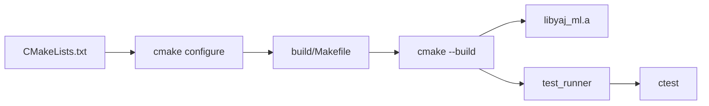

# CMake expliqué pour débutants

**CMake** est un outil qui **génère** des fichiers de build (Makefiles, projets IDE, etc.) à partir d'une description portable du projet. Tu n'écris pas directement les règles de compilation — tu décris *quoi* construire, et CMake produit *comment*.

## Pourquoi CMake existe

Imagine que ton projet doit compiler sur Linux (Make), Windows (Visual Studio) et macOS (Xcode). Écrire trois systèmes de build différents est pénible. CMake résout ça :

```
CMakeLists.txt  ──►  cmake  ──►  Makefile (ou Ninja, ou .sln)
                                      │
                                      ▼
                                 binaires compilés
```

Pour YAJ-ML, CMake génère un Makefile dans le dossier `build/`.

## Prérequis

```bash
cmake --version   # minimum 3.16
gcc --version
```

## Les 3 commandes à retenir

```bash
# 1. Configurer (une fois, ou quand CMakeLists.txt change)
cmake -S . -B build -DCMAKE_BUILD_TYPE=Debug

# 2. Compiler
cmake --build build

# 3. Tester
ctest --test-dir build --output-on-failure
```

| Option | Signification |
|--------|---------------|
| `-S .` | **S**ource : racine du projet (où est CMakeLists.txt) |
| `-B build` | **B**uild : dossier de sortie (créé automatiquement) |
| `-DCMAKE_BUILD_TYPE=Debug` | Mode debug (-g -O0) ou Release (-O2) |

## Structure des fichiers CMake dans YAJ-ML

```
ML-C/
├── CMakeLists.txt              ← racine du projet
├── cmake/
│   └── CompilerWarnings.cmake  ← module réutilisable
├── models/
│   └── CMakeLists.txt          ← sous-projet (stubs)
└── tests/
    └── CMakeLists.txt          ← sous-projet (tests)
```

## CMakeLists.txt racine — ligne par ligne

Fichier : [`CMakeLists.txt`](../../CMakeLists.txt)

```cmake
cmake_minimum_required(VERSION 3.16)
```
Version minimale de CMake requise.

```cmake
project(yaj_ml VERSION 0.1.0 LANGUAGES C)
```
Nom du projet, version, langage C uniquement.

```cmake
set(CMAKE_C_STANDARD 17)
set(CMAKE_C_STANDARD_REQUIRED ON)
set(CMAKE_C_EXTENSIONS OFF)
```
Force le standard **C17** sans extensions GNU.

```cmake
if(NOT CMAKE_BUILD_TYPE AND NOT CMAKE_CONFIGURATION_TYPES)
    set(CMAKE_BUILD_TYPE Debug CACHE STRING "Build type" FORCE)
endif()
```
Si tu oublies `-DCMAKE_BUILD_TYPE`, CMake choisit Debug par défaut.

```cmake
list(APPEND CMAKE_MODULE_PATH "${CMAKE_CURRENT_SOURCE_DIR}/cmake")
include(CompilerWarnings)
```
Ajoute le dossier `cmake/` au chemin de recherche, puis charge notre module de warnings.

```cmake
add_library(yaj_ml STATIC
    src/error.c
    src/vector.c
    src/matrix.c
)
```
Crée une **bibliothèque statique** nommée `yaj_ml` à partir de ces sources.

```cmake
target_include_directories(yaj_ml
    PUBLIC "${CMAKE_CURRENT_SOURCE_DIR}/include"
)
```
Les cibles qui lient `yaj_ml` héritent automatiquement du chemin `include/`.

```cmake
target_link_libraries(yaj_ml PUBLIC m)
```
Lie `libm` (math). `PUBLIC` propage aussi aux consommateurs de `yaj_ml`.

```cmake
yaj_ml_set_compiler_warnings(yaj_ml)
```
Applique `-Wall -Wextra -Wpedantic` (défini dans `cmake/CompilerWarnings.cmake`).

```cmake
if(CMAKE_BUILD_TYPE STREQUAL "Debug")
    target_compile_options(yaj_ml PRIVATE -g -O0)
else()
    target_compile_options(yaj_ml PRIVATE -O2)
endif()
```
Flags de compilation selon le mode.

```cmake
add_subdirectory(models)
enable_testing()
add_subdirectory(tests)
```
Descend dans les sous-dossiers `models/` et `tests/`, active CTest.

## Le module CompilerWarnings

Fichier : [`cmake/CompilerWarnings.cmake`](../../cmake/CompilerWarnings.cmake)

```cmake
function(yaj_ml_set_compiler_warnings target)
    if(MSVC)
        target_compile_options(${target} PRIVATE /W4)
    else()
        target_compile_options(${target} PRIVATE
            -Wall -Wextra -Wpedantic -Wshadow
            -Wconversion -Wdouble-promotion
        )
    endif()
endfunction()
```

C'est une **fonction CMake** réutilisable. Au lieu de répéter les flags partout, on appelle `yaj_ml_set_compiler_warnings(mon_target)`.

## tests/CMakeLists.txt

```cmake
add_executable(test_runner
    test_main.c test_error.c test_vector.c test_matrix.c
)
target_link_libraries(test_runner PRIVATE yaj_ml m)
target_include_directories(test_runner PRIVATE "${CMAKE_CURRENT_SOURCE_DIR}")

add_test(NAME unit_tests COMMAND test_runner)
```

| Ligne | Rôle |
|-------|------|
| `add_executable` | Crée le binaire `test_runner` |
| `target_link_libraries` | Lie la bibliothèque core + libm |
| `add_test` | Enregistre le test pour `ctest` |

## Flux complet CMake



## Concepts clés

### Cible (target)

Tout ce que CMake construit est une **cible** : bibliothèque, exécutable, test. Exemples : `yaj_ml`, `test_runner`.

### PUBLIC vs PRIVATE

```cmake
target_include_directories(yaj_ml PUBLIC include/)
target_compile_options(yaj_ml PRIVATE -O2)
```

| Visibilité | Signification |
|------------|---------------|
| `PUBLIC` | S'applique à cette cible ET à ceux qui la lient |
| `PRIVATE` | S'applique seulement à cette cible |
| `INTERFACE` | S'applique seulement aux consommateurs, pas à la cible |

### add_subdirectory

Quand CMake rencontre `add_subdirectory(tests)`, il exécute `tests/CMakeLists.txt` dans un scope enfant. Les cibles créées là restent visibles au niveau parent.

## CMake vs Makefile dans YAJ-ML

| | Makefile | CMake |
|---|----------|-------|
| Fichier principal | `Makefile` | `CMakeLists.txt` |
| Dossier de build | `build-make/` | `build/` |
| Commande compile | `make` | `cmake --build build` |
| Commande test | `make test` | `ctest --test-dir build` |
| Fichiers générés | Aucun | Makefile, cache, etc. dans `build/` |

Les deux produisent **exactement le même code**. Utilise celui que tu préfères.

## Quand modifier quoi

| Tu veux... | Fichier à modifier |
|------------|-------------------|
| Ajouter un `.c` au core | `CMakeLists.txt` racine (`add_library`) + `Makefile` (`LIB_SRCS`) |
| Ajouter un test | `tests/CMakeLists.txt` + `Makefile` (`TEST_SRCS`) |
| Changer les warnings | `cmake/CompilerWarnings.cmake` + `Makefile` (`CFLAGS`) |
| Ajouter un modèle ML | `models/<nom>/CMakeLists.txt` + `models/CMakeLists.txt` |

## Dépannage

```bash
# Reconfigurer from scratch
rm -rf build
cmake -S . -B build -DCMAKE_BUILD_TYPE=Debug
cmake --build build

# Voir les variables CMake
cmake -S . -B build -LAH | grep CMAKE_C

# Compiler en verbose (voir les commandes gcc)
cmake --build build --verbose
```

## Pour aller plus loin

- [Documentation officielle CMake](https://cmake.org/documentation/)
- Tutoriel : « CMake Tutorial » sur cmake.org
- Quand YAJ-ML aura plusieurs modèles, chaque `models/foo/CMakeLists.txt` fera un `add_library(yaj_ml_foo ...)` qui lie `yaj_ml`
