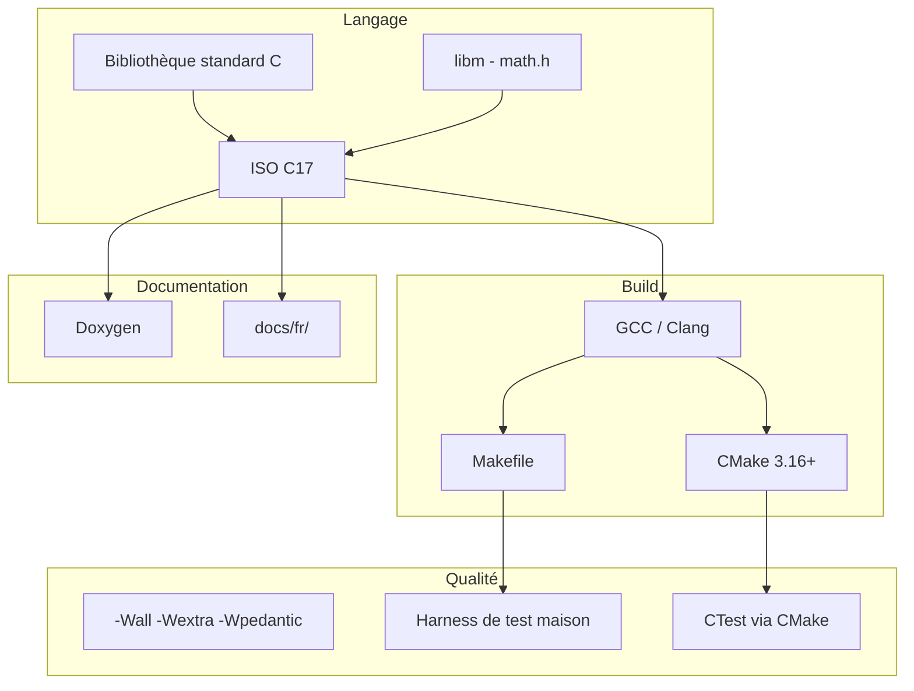

# Stack technique

Ce document décrit **tous les outils et conventions** utilisés dans YAJ-ML, pour que tu saches exactement avec quoi tu travailles.

## Vue d'ensemble



## Langage : ISO C17

| Aspect | Choix |
|--------|-------|
| Standard | C17 (ISO/IEC 9899:2018) |
| Compilateur | GCC ou Clang |
| Extensions | Interdites (`CMAKE_C_EXTENSIONS OFF`) |
| C++ | Non utilisé |

### Headers autorisés

Uniquement la **bibliothèque standard C** :

| Header | Usage dans YAJ-ML |
|--------|-------------------|
| `<stdlib.h>` | `malloc`, `calloc`, `free` |
| `<string.h>` | `memcpy`, `memset` |
| `<math.h>` | `sqrt`, `exp`, `log` (futurs modèles) |
| `<stddef.h>` | `size_t`, `NULL` |
| `<stdint.h>` | types entiers fixes |
| `<stdbool.h>` | `bool`, `true`, `false` |
| `<stdio.h>` | affichage debug (tests, examples) |

### Interdit

- BLAS, LAPACK, OpenCV, Eigen, GSL
- Bibliothèques C++ (STL, Eigen)
- Frameworks de test externes (Unity, Criterion) — harness maison à la place

## Outils de compilation

### Compilateur

```bash
gcc -std=c17 -Wall -Wextra -Wpedantic -Iinclude -c src/vector.c
```

| Flag | Rôle |
|------|------|
| `-std=c17` | Standard C17 |
| `-Wall` | Tous les warnings courants |
| `-Wextra` | Warnings supplémentaires |
| `-Wpedantic` | Conformité stricte au standard |
| `-Wshadow` | Détecte les variables qui masquent d'autres |
| `-Wconversion` | Avertit sur les conversions implicites |
| `-Wdouble-promotion` | Avertit si `float` est promu en `double` |
| `-g -O0` | Debug : symboles, pas d'optimisation |
| `-O2` | Release : optimisations |
| `-lm` | Lie la bibliothèque mathématique |

### Makefile

- Fichier : [`Makefile`](../../Makefile)
- Sortie : `build-make/`
- Doc : [02_makefile.md](02_makefile.md)

### CMake

- Fichier : [`CMakeLists.txt`](../../CMakeLists.txt)
- Sortie : `build/`
- Doc : [03_cmake.md](03_cmake.md)

### Archive statique

La bibliothèque core est une **`.a`** (archive statique) :

```
build-make/lib/libyaj_ml.a   (Makefile)
build/libyaj_ml.a            (CMake)
```

À la liaison, le code nécessaire est **copié** dans l'exécutable. Pas de `.so` / DLL pour l'instant.

## Tests

### Harness maison

Fichiers : `tests/test_harness.h`, `tests/test_main.c`

```c
TEST(mon_test) {
    ASSERT_EQ(42, 42);
    ASSERT_NEAR(3.14, 3.141, 1e-3);
    ASSERT_STATUS_OK(vec_create(3, &v));
}
```

| Macro | Rôle |
|-------|------|
| `TEST(name)` | Déclare et enregistre un test |
| `ASSERT_EQ(a, b)` | Égalité stricte |
| `ASSERT_NEAR(a, b, eps)` | Égalité à epsilon près |
| `ASSERT_STATUS_OK(s)` | Vérifie `s == YAJ_ML_OK` |

### Lancer les tests

```bash
make test                              # Makefile
ctest --test-dir build --output-on-failure   # CMake
./build-make/bin/test_runner           # Direct
```

## Documentation

| Type | Où | Outil |
|------|-----|-------|
| API publique | `include/yaj_ml/*.h` | Commentaires Doxygen |
| Guides pédagogiques | `docs/fr/` | Markdown (ce dossier) |
| Référence HTML | `docs/html/` | `doxygen docs/Doxyfile.in` |

### Générer la doc Doxygen

```bash
# Installer doxygen si nécessaire
sudo apt install doxygen   # Debian/Ubuntu

doxygen docs/Doxyfile.in
# Ouvrir docs/html/index.html
```

## Conventions de code

| Règle | Exemple |
|-------|---------|
| Nommage | `snake_case` |
| Indentation | 4 espaces |
| Accolades | Style K&R (accolade ouvrante sur la même ligne) |
| Préfixe public | `yaj_ml_`, `vec_`, `mat_` |
| Pas de macros | Sauf include guards et harness de test |
| `const` | Paramètres en lecture seule |
| Erreurs | Retour `yaj_ml_status_t`, jamais silencieux |
| Mémoire | Paire `create`/`free`, propriété explicite |

### Exemple de style

```c
yaj_ml_status_t vec_dot(const yaj_ml_vec_t *a, const yaj_ml_vec_t *b,
                        double *out)
{
    if (a == NULL || b == NULL || out == NULL) {
        return YAJ_ML_ERR_NULL_PTR;
    }
    /* ... */
}
```

## Structure Git

```
main                    branche principale
├── include/yaj_ml/     headers publics
├── src/                implémentation core
├── models/             modèles ML (stubs)
├── tests/              tests unitaires
├── docs/fr/            documentation pédagogique
├── Makefile            build simple
└── CMakeLists.txt      build CMake
```

### Dossiers ignorés (`.gitignore`)

```
build/          # sortie CMake
build-make/     # sortie Makefile
docs/html/      # doc Doxygen générée
```

## Roadmap technique

| Phase | Contenu | Statut |
|-------|---------|--------|
| 0 — Scaffold | Core math, build, tests, docs | Fait |
| 1 — Linear Regression | Premier modèle ML | À faire |
| 2 — Classification | Perceptron, Logistic Regression | À faire |
| 3 — Instance-based | KNN | À faire |
| 4 — Margin-based | SVM | À faire |
| 5 — Extensions | Trees, PCA, K-Means | Futur |

## Ressources pour approfondir

| Sujet | Ressource |
|-------|-----------|
| C17 | « Modern C » de Jens Gustedt, ou cppreference.com |
| Make | [02_makefile.md](02_makefile.md) |
| CMake | [03_cmake.md](03_cmake.md), cmake.org/tutorial |
| Algèbre linéaire ML | « Mathematics for Machine Learning » (Deisenroth) |
| Algorithmes ML | « Pattern Recognition and Machine Learning » (Bishop) |
